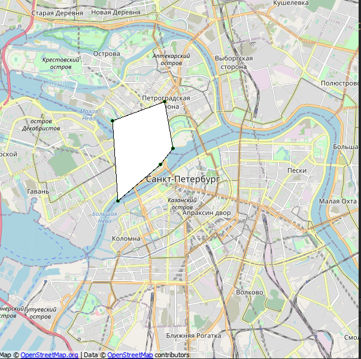

# Map-Polygone-Editor
Программа для редактирования полигона на карте OpenStreetMap QML.

 
 
### Функциональность:
1. Добавление точки по клику ЛКМ
2. Удаление точки по клику ПКМ вблизи точки
3. Перемещение ближайшей точки при зажатой ЛКМ (если расстояние до точки меньше ~ 100 метров)
4. Добавление новой точки к ребру при слике ЛКМ возле этого ребра (расстояние от клика до ребра менее 1 км)

### Допущения:
1. Для сохранения константности параметров, опредеяющих "близости" - отключен zoom у окна
2. Фиксированный размер окна

